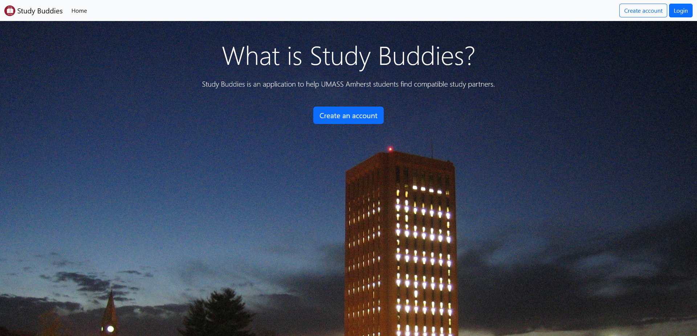
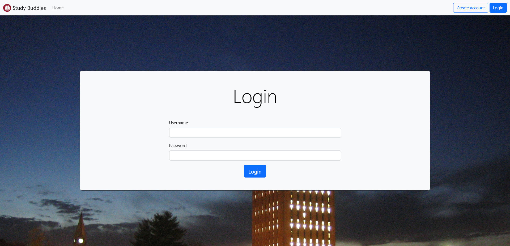
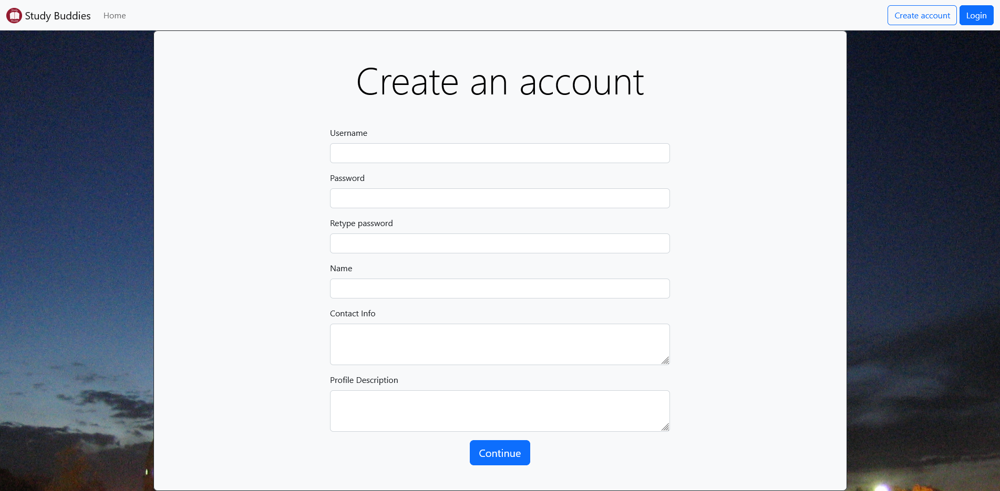
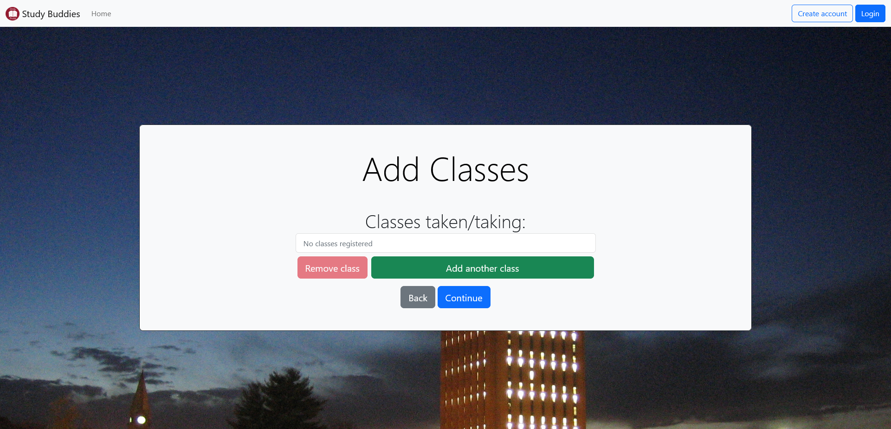
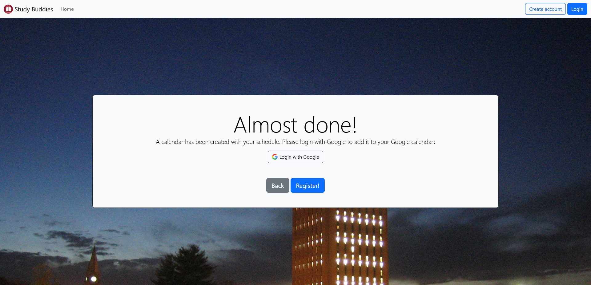
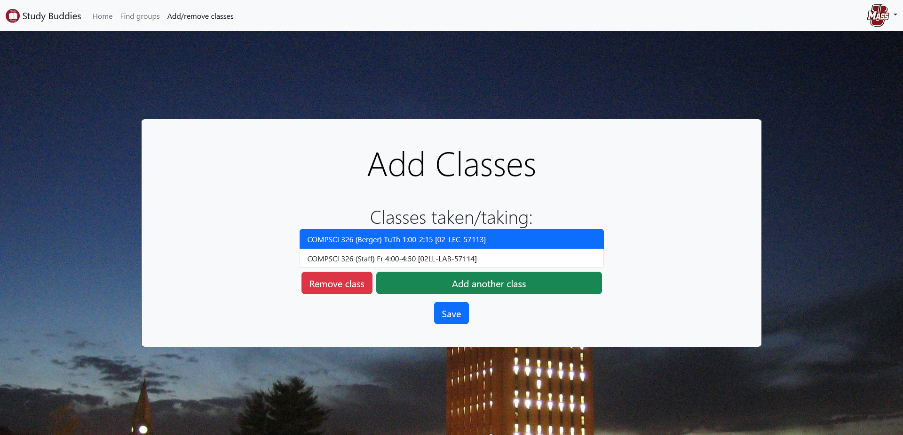
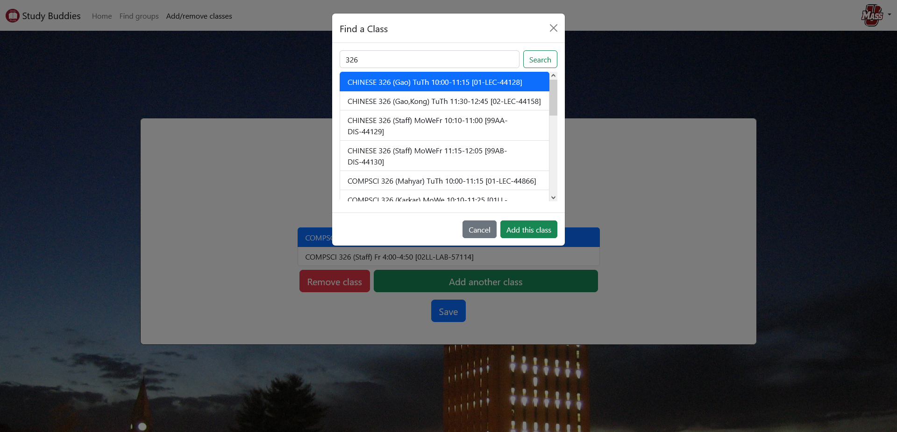
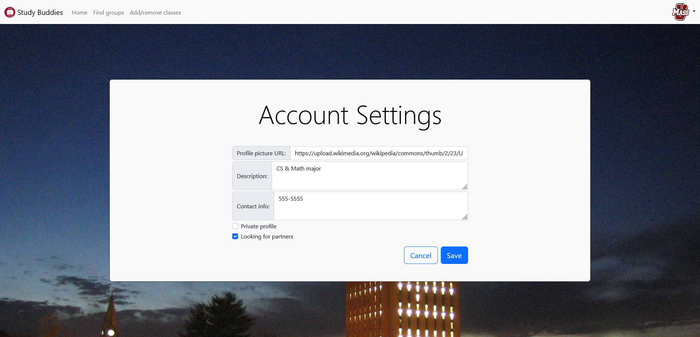
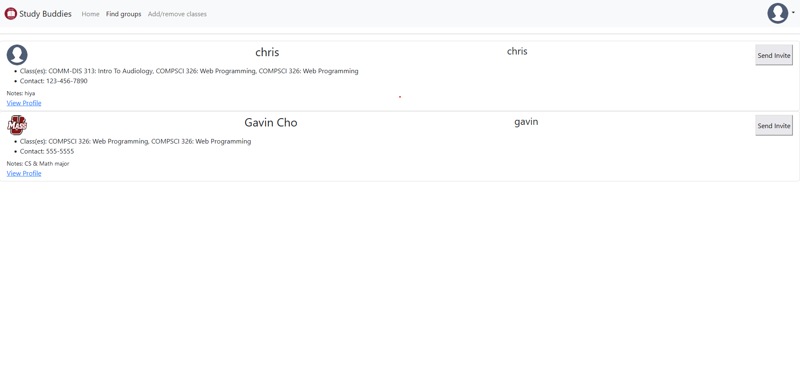

# Team Lambda: Study Buddies (Fall 2022 Semester)

# Overview

Study Buddies is a web application to help UMass student find partners to study with. In which students can create accounts to fill out with current courses and previous courses they have taken to match with other students using our algorithm to guarantee relavant students can find each other. after finding other students you have the ability to invite them and create a study group and set up times to study for your courses. And if you are feeling particularly adventurousyou can even look for individual students if you happen to know their id, but only if they allow it since we should respect one anothers privacy. you can also just browse for a group thats already been formed with our very own group finder.

# Team Members

- Andrew LaBelle ([https://github.com/alabelle127](https://github.com/alabelle127))
- Gavin Cho ([https://github.com/gavin-k-cho](https://github.com/gavin-k-cho))
- Chris Manning ([https://github.com/KaenCS](https://github.com/KaenCS))

# User Interface

## Homepage

Landing page for new users to the website.



## Navbar

Allow user to navigate between pages.


## Login

Allow user to log in to their account.



## Register

Create a new user.





## Class Add/Remove

Edit currently taken classes.



## Class Search

Search for a class to add.



## Account Settings

Change user settings.



## Partner Finder



## User Profile (TODO)

# APIs/URL Routes

## Search

Search for classes

**URL** : `/api/classes/search`

**URL Parameters** : `q=[string]` where `q` is the search query.

**Method** : `GET`

### Response

A list of Class results

**Example**

```json
[
  {
    "_id": {
      "$oid": "6377d94b5a9fa1629b0b2c5b"
    },
    "class": {
      "subject": {
        "id": "ACCOUNTG",
        "name": "Accounting"
      },
      "number": "221",
      "name": "Principles of Financial Accounting"
    },
    "name": {
      "number": "01",
      "type": "LEC",
      "id": "42505"
    },
    "instructors": [
      {
        "name": "Kerri Bohonowicz",
        "email": "bohonowicz@isenberg.umass.edu"
      }
    ],
    "meeting_times": {
      "days": {
        "mon": false,
        "tue": true,
        "wed": false,
        "thu": true,
        "fri": false,
        "sat": false,
        "sun": false
      },
      "startTime": {
        "$numberInt": "1430"
      },
      "endTime": {
        "$numberInt": "1545"
      }
    },
    "room": "Mahar room 108"
  },
  {
    "_id": {
      "$oid": "6377d94b5a9fa1629b0b2c59"
    },
    "class": {
      "subject": {
        "id": "ACCOUNTG",
        "name": "Accounting"
      },
      "number": "196ISH",
      "name": "Honors Independent Study In Accounting"
    },
    "name": {
      "number": "01",
      "type": "IND",
      "id": "42545"
    },
    "instructors": [
      {
        "name": "Staff",
        "email": null
      }
    ],
    "meeting_times": null,
    "room": null
  }
]
```

## Login

Attempt to login a user

**URL** : `/api/login`

**Method** : `POST`

**Payload** :

```json
{
  "username": "[string]",
  "password": "[string]"
}
```

### Success Response

**Example**

```json
{
  "success": true,
  "userID": "6378117a2cf3373842d32b65"
}
```

### Error Response

**Example**

```json
{
  "success": false,
  "userID": null
}
```

## Logout

Logout a user

**URL** : `/api/logout`

**Method** : `POST`

## Me

Get the current logged in user

**URL** : `/api/me`

**Method** : `GET`

### Response

**Logged in example**

```json
{
  "loggedIn": true,
  "userID": "6378117a2cf3373842d32b65"
}
```

**Not logged in example**

```json
{
  "loggedIn": false,
  "userID": null
}
```

## Register

Attempt to register a new user

**URL** : `/api/register`

**Method** : `POST`

**Payload** :

```json
{
  "username": "[string]",
  "password": "[string]",
  "real_name": "[string]",
  "contact": "[string]",
  "description": "[string]",
  "classes": "[Array<ObjectId>]"
}
```

### Success Response

**Example**

```json
{
  "success": true
}
```

### Error Response

**Example**

```json
{
  "success": false
}
```

## Username Exists

Check database to see if user with the given username already exists.

**URL** : `/api/exists/:username`

**Method** : `GET`

**Example**

```json
{
  "exists": true
}
```

## User registered classes

Get user's registered classes. User requested must have a public profile or the user must be self.

**URL** : `/api/users/:userID/registered_classes`

**Method** : `GET`

### Success Response

**Example**

```json
{
  "success": true,
  "data": [
    {
      "_id": {
        "$oid": "6377d94c5a9fa1629b0b2c6c"
      },
      "class": {
        "subject": {
          "id": "ACCOUNTG",
          "name": "Accounting"
        },
        "number": "221",
        "name": "Principles of Financial Accounting"
      },
      "name": {
        "number": "01MS",
        "type": "LAB",
        "id": "42522"
      },
      "instructors": [
        {
          "name": "Staff",
          "email": null
        }
      ],
      "meeting_times": {
        "days": {
          "mon": false,
          "tue": false,
          "wed": false,
          "thu": false,
          "fri": true,
          "sat": false,
          "sun": false
        },
        "startTime": {
          "$numberInt": "1220"
        },
        "endTime": {
          "$numberInt": "1310"
        }
      },
      "room": "Sch of Management G31"
    }
  ]
}
```

### Error Response

**Example**

```json
{
  "success": false,
  "message": "Unauthorized"
}
```

## User registered classes

Set user's registered classes

**URL** : `/api/users/:userID/registered_classes`

**Method** : `POST`

**Payload** :

```json
{
  "classes": "[Array<Class>]"
}
```

### Success Response

**Example**

```json
{
  "success": true
}
```

### Error Response

**Example**

```json
{
  "success": false,
  "message": "Unauthorized"
}
```

## Get user

Get user data. If the user has a private profile and the requested user is not self, only returns username and profile picture instead of all the data.

**URL** : `/api/users/:userID`

**Method** : `GET`

### Success Response

**Example**

```json
{
  "success": true,
  "data": {
    "username": "gavin",
    "real_name": "Gavin Cho",
    "contact_info": "555-555-5555",
    "description": "CS & Math major senior",
    "profile_picture": "https://upload.wikimedia.org/wikipedia/commons/thumb/7/7e/Circle-icons-profile.svg/512px-Circle-icons-profile.svg.png",
    "private_profile": false,
    "looking_for_partners": true,
    "currentCourses": ["6377da885a9fa1629b0b3447"]
  }
}
```

### Success Response (Private profile)

**Example**

```json
{
  "success": true,
  "data": {
    "username": "gavin",
    "profile_picture": "https://upload.wikimedia.org/wikipedia/commons/thumb/7/7e/Circle-icons-profile.svg/512px-Circle-icons-profile.svg.png"
  }
}
```

### Error Response

**Example**

```json
{
  "success": false,
  "message": "Student does not exist"
}
```

## Set user settings

Set user data. Requested user must be self.

**URL** : `/api/users/:userID`

**Method** : `POST`

**Payload** :

```json
{
  "profile_picture": "[URL]",
  "description": "[string]",
  "contact": "[string]",
  "looking_for_partners": "[boolean]",
  "private_profile": "[boolean]"
}
```

### Success Response

**Example**

```json
{
  "success": true
}
```

### Error Response

**Example**

```json
{
  "success": false,
  "message": "Not authorized"
}
```

## Get Google authentication URL

Get URL which allows user to login to their Google account so that a calendar can be created with their class schedule. After a user logs in, redirects to `/api/google_auth`.

**URL** : `/api/google_auth_url`

**Method** : `GET`

### Success Response

**Example**

```json
{
  "url": "https://accounts.google.com/o/oauth2/v2/auth/oauthchooseaccount?access_type=offline&prompt=consent&scope=https%3A%2F%2Fwww.googleapis.com%2Fauth%2Fcalendar&response_type=code&client_id=(redacted)&redirect_uri=http%3A%2F%2Flocalhost%3A8080%2Fapi%2Fgoogle_auth&service=lso&o2v=2&flowName=GeneralOAuthFlow"
}
```

### Success Response (Private profile)

**Example**

```json
{
  "success": true,
  "data": {
    "username": "gavin",
    "profile_picture": "https://upload.wikimedia.org/wikipedia/commons/thumb/7/7e/Circle-icons-profile.svg/512px-Circle-icons-profile.svg.png"
  }
}
```

### Error Response

**Example**

```json
{
  "success": false,
  "message": "Student does not exist"
}
```

## List of Compatible Partners

Gets a list of users that are taking one or more of the same classes as the current user

**URL** : `/api/users/:userID/compatible_partners`

**Method** : `GET`

### Success Response

**Example**

```json
{
  "success": true,
  "data" : "[List of compatabile partners]"
}
```

### Error Response

```json
{
  "success": false,
  "message": "User has not registered any classes"
}
```

## Return Matches for User

Returns a list of users a currently logged in user is matched with

**URL**: `/api/users/:userID/matches`

**Method**: `GET`

### Success Response

**Example**

```json
{
  "success": true,
  "data": "[List of Matches for that user]"
}
```

### Error Response

**Example**

```json
{
  "success": false,
  "message": "failed to get matches for user"
}
```

## Create a match from user 1 to user 2

Creates a match listing in the database from user 1 to user 2 upon clicking "invite" in finder page

**URL**: `/api/notifications/:userID1/:userID2`

**Method**: `POST`

### Success Response

**Example**

```json
{
  "success": true,
}
```

### Error Response

**Example**

```json
{
  "success": false,
  "message": "Error setting up meeting"
}
```

<!-- ## Meeting Scheduling (TODO) -->

<!-- ## Incoming Notifications/Match requests (TODO) -->

<!-- ## User's Current Meetings (TODO) -->

# Database

## 2022 Fall Classes Collection

UMass Fall 2022 semester classes, scraped from SPIRE.

**Example document**

```json
{
  "_id": {
    "$oid": "6377d9545a9fa1629b0b2cbd"
  },
  "class": {
    "subject": {
      "id": "AEROSPAC",
      "name": "Aerospace Studies"
    },
    "number": "335",
    "name": "Leading People and Effective Communication I"
  },
  "name": {
    "number": "01LL",
    "type": "LAB",
    "id": "42602"
  },
  "instructors": [
    {
      "name": "Lucas Hall",
      "email": "lucashall@umass.edu"
    },
    {
      "name": "Darrick Dwyer",
      "email": "djdwyer@umass.edu"
    }
  ],
  "meeting_times": {
    "days": {
      "mon": true,
      "tue": false,
      "wed": false,
      "thu": false,
      "fri": false,
      "sat": false,
      "sun": false
    },
    "startTime": {
      "$numberInt": "830"
    },
    "endTime": {
      "$numberInt": "1130"
    }
  },
  "room": "Dickinson Hall room 216"
}
```

## Members Collection

Registered users.

**Example document**

```json
{
  "_id": {
    "$oid": "63940f91f47ae47dca683f1b"
  },
  "username": "gavin3000",
  "salt": "258044fec20da92826061dbb511b25a7",
  "hash": "3e97ec1f34c38b0225cc9e4c1e989a24a425227db5a0f50bfee280036e994998b33c9aaf5be13176cb46e86f7c588840c1fb0ebd9125130241173ab9cda04e7f",
  "real_name": "Gavin",
  "contact": "555-5555",
  "description": "CS & Math major",
  "profile_picture": "https://upload.wikimedia.org/wikipedia/commons/thumb/7/7e/Circle-icons-profile.svg/512px-Circle-icons-profile.svg.png",
  "private_profile": false,
  "looking_for_partners": true,
  "classes": ["6377da885a9fa1629b0b3447"],
  "google_credentials": {
    "access_token": "(redacted)",
    "refresh_token": "(redacted)",
    "scope": "https://www.googleapis.com/auth/calendar",
    "token_type": "Bearer",
    "expiry_date": {
      "$numberDouble": "1.6706512905580E+12"
    }
  }
}
```

## Session Collection

Currently logged in user sessions.

**Example document**

```json
{
  "_id": "qFUD6TxWCCjllyYm0W9PGvJodLamrvBz",
  "expires": {
    "$date": {
      "$numberLong": "1671313209536"
    }
  },
  "session": "{\"cookie\":{\"originalMaxAge\":604800000,\"expires\":\"2022-12-17T00:44:18.835Z\",\"httpOnly\":true,\"path\":\"/\"},\"userID\":\"6393d654edc7c4e145be02e7\"}"
}
```

## Matches Collection

```json
{
  "_id": "ObjectId('637982c7c929c60f93db065a')"
  "user1": "brian"
  "user2": "mark"
},
```

## Meetings Collection

```json
{
  "_id": "ObjectId('637acb1b05189442bf844bb5')"
  "userA": "Walter"
  "userB": "Jesse"
  "meeting_times": "Object"
    "fri": "Array"
      "0": "Object"
    "mon": "Array"
      "0": "Object"
        "startTime": 1800
        "endTime": 2400
    "sat": "Array"
      "0": "Object"
    "sun": "Array"
      "0": "Object"
    "thu": "Array"
      "0": "Object"
    "tue": "Array"
      "0": "Object"
    "wed": "Array"
      "0": "Object"
},
```

## Notifications Collection

```json
{
  "_id": "ObjectId('63798e380d2cb3075765f4dc')"
  "studentID": "Student0"
  "notifs": "Array"
    "0": "CSMajor123"
    "1": "MathMajor456"
},
```

# Authentication/Authorization

Authentication for login is implemented with the miniCrypt.js library (ported to TypeScript), generally following the example provided from class. When a user is logged in a session is created in the database so if a user leaves the page and comes back they will still be logged in. The session is used to check what logged in user is making an API request. So sensitive API calls such as changing a user's profile picture only succeed if the user making the request is the same as the user whose profile picture is being changed. When viewing a user's profile, if the user has a private profile and the viewer is not the user itself, only the user's username and profile picture will be visible. No user has more permissions than any other user.

# Division of Labor

**Gavin:**

- User login (wireframes, frontend, and backend)
- Register new user (wireframes, frontend, and backend)
- Add/remove/search classes (wireframes, frontend, and backend)
- Create class schedule in Google Calendar (and handle Google authentication)
- Scrape SPIRE for class data

**Andrew:**

- Student Finder Page (wireframes, frontend, backend)
- Allows users to match with other users via invite link on finder page for each user (frontend and backend)
- Allows users to view other users profiles via link on their section in the finder page

\*\*Chris:

- Created and maintained MongoDB database
- Created and maintained the Heroku App (recently had to transfer ownership to Gavin for dynos)
- Student (wireframes, frontend, and backend)
- Group (wireframes, frontend, eventually became deprecated due to constraints)

# Conclusion

This group project proved to be a challenging experience in which we had to learn many different and new concepts that we had not previously worked with before in any scenarios. Learning how to work with express js, mongo db, and other new concepts proved to be difficult at times but I do feel were fulfilling in the end. I feel as though it would have been helpful to have worked with these concepts more throughout the class to gain experience in them before working with them on a larger scale. Another major difficulty for my grouppmates was setting up and getting heroku to work effectively.
