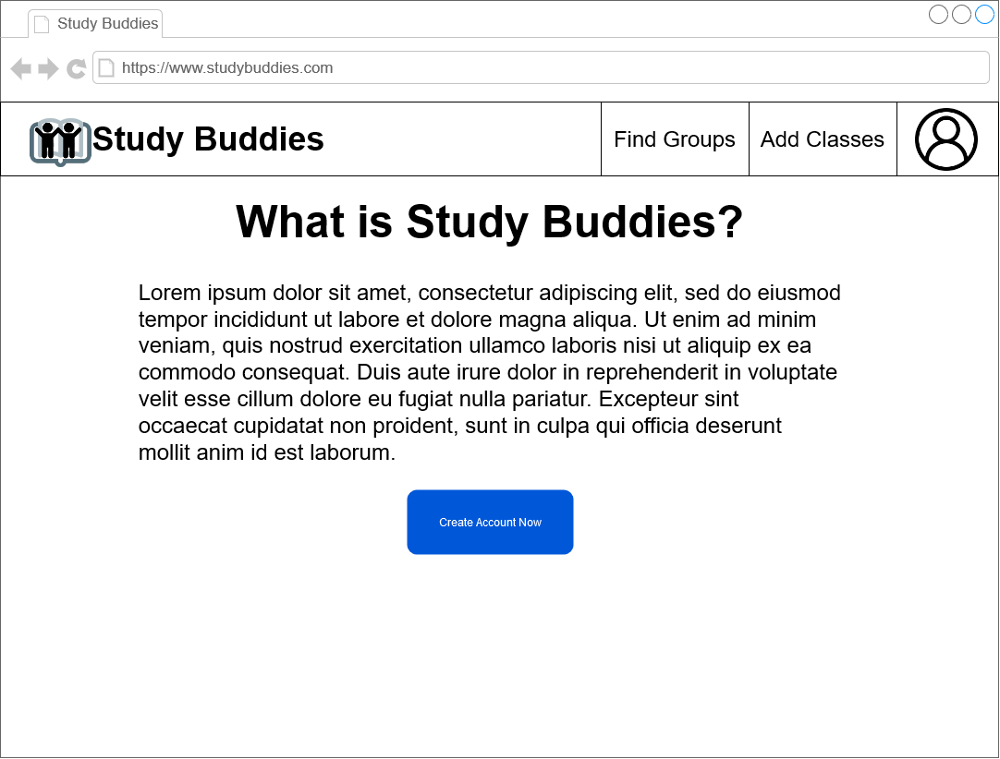
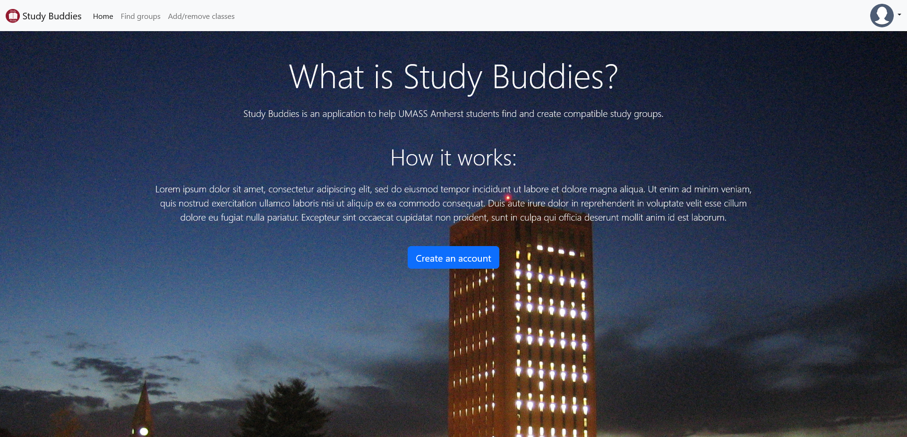
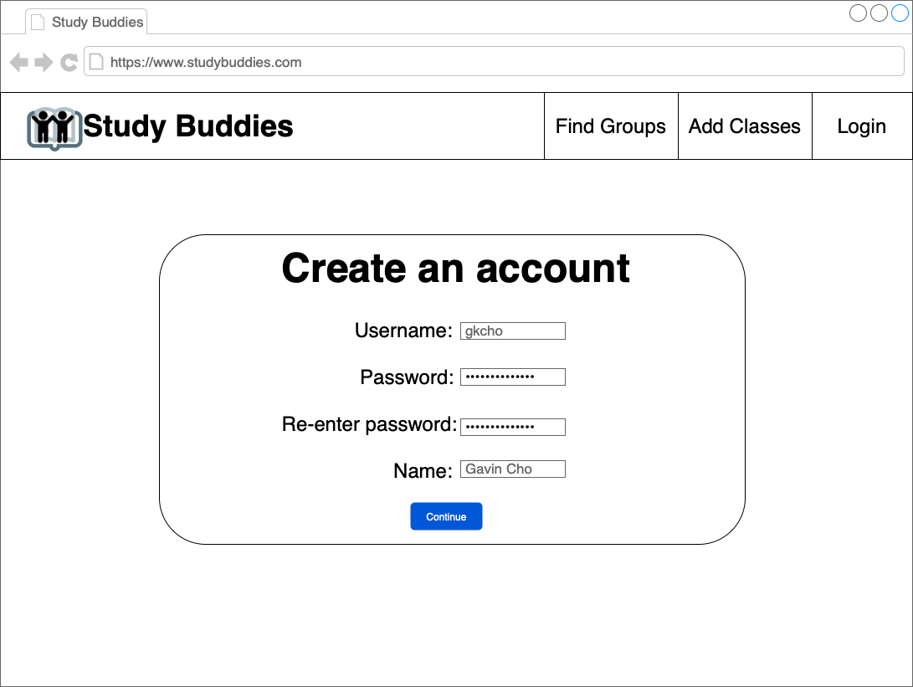
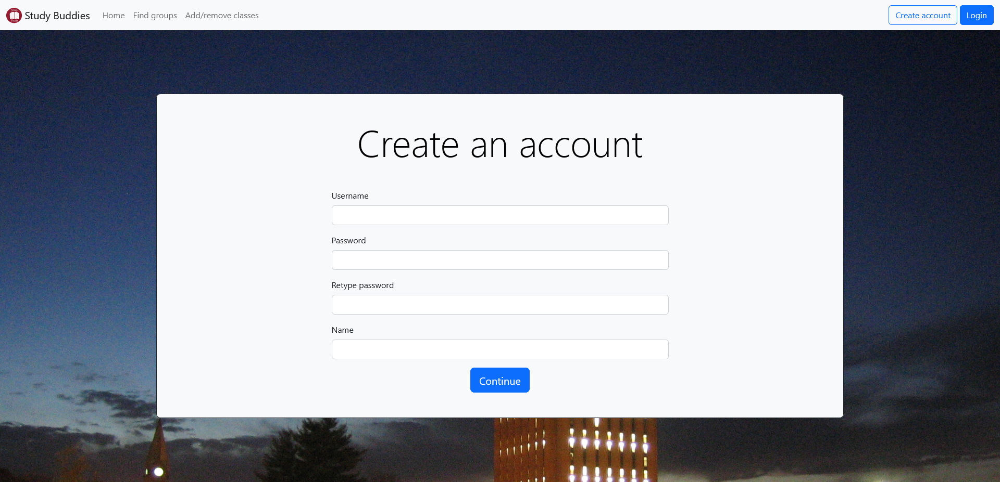

<<<<<<< HEAD
## Navigation Bar

- also includes notifcations
- login/register
- if already logged in
-   display profile picture with dropdown menu for viewing your profile

## Group/Student finder page

- list of groups/students
- clicking on one brings you to that group/student's page

## Group page

- Group name
- Students in the group
- Applicable courses 
- Group description

## Student page

- name/username
- bio/contact (can be set to private)
- classes enrolled/classes they have taken
- groups they are a part of (can be set to private)
- link for schedule/schedule page (can be set to private)

## Account Page/Settings

- change username/password/email
- profile picture (optional)
- etc.

## Courses Page

- allows students to add courses
- course information (potentially pulled from spire
-   times, locations, etc.

## Homepage that also helps users set up an account/login page

- walks users through account setup
- login for existing users
- potentially information about the site and what it's for
- maybe ask user if they want to import a schedule

## Calendar page

- potentially links user to google calendar
- maybe embedded calendar
- maybe apple calendar as well

# Wireframes
=======
# Wireframes and Screenshots
>>>>>>> main

## Navigation Bar and Settings Dropdown Menu

## Homepage

## Register Account

## Student/Group Finder Page

<<<<<<< HEAD
## Group page

## Student page

=======

# Division of Labor
Gavin:
- Navbar
- Account settings
- Login/Register/Account setup
- Homepage

Andrew:

Chris:
>>>>>>> main
